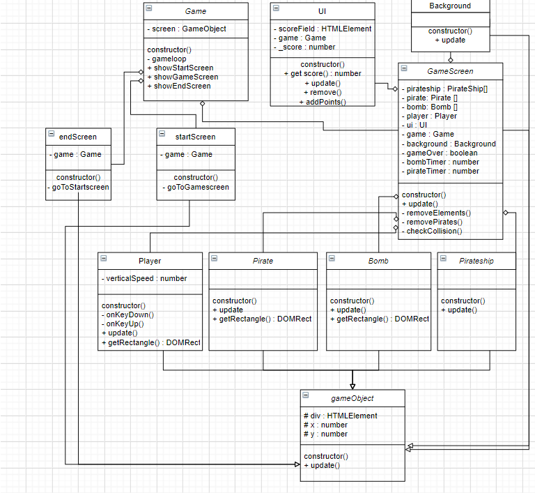

# Pirate-Game
Klassendiagram:
 
    
  
 
 
<a href = "https://timowieme.github.io/Pirate-Game/"> Link naar mijn game </a>

# PRG04 opdracht 

Object Oriented Game Design in Typescript - inleveropdracht

## Deadline: Week 9 - 30 juni - 10:00 uur

Voor dit vak werk je wekelijks aan je typescript game. Deze reposistory bevat je wekelijkse updates. **Let op de deadline! Hierna kan je geen werk meer inleveren**

Je werk wordt beoordeeld volgens de cursushandleiding. Je krijgt punten voor onderstaande criteria, door elk punt individueel te *beschrijven in dit inleverdocument* én *toe te passen in je code*.

---

 
 
 

## Gameplay

Toelichting gameplay
     
    
 Ik heb een game gemaakt waarbij een player de piraten moet doden en de bommen moet ontwijken. De speler kan alleen naar boven en naar beneden bewegen met de pijltjes toetsen.
 De piraten en de bommen spawnen aan de rechterkant van de map. Wanneer een speler een piraat raakt krijgt hij of zij een punt.
 Wanneer de speler 50 punten behaald zonder een bom te raken, wint hij/zij het spel. 
 Wanneer de speler een bom raakt stopt het spel en heeft de speler verloren.
 Er zijn ook piratenboten in het spel, deze bewegen alleen van links naar rechts boven en onderin de map. Deze zijn er als versiering.
  
 In week 6 had ik nog het idee om piraten in de rug te laten komen, maar nu ik de game had gemaakt vond ik dat het spel al lastig zat was met alleen bommen die van voren    komen, dus die heb ik eruit gehaald.

## Classes

Toelichting classes
Ik heb de classes : Player, pirate, bomb en pirateship.
Buiten deze 4 classes heb ik ook een Startscreen gemaakt, een endScreen gemaakt, een gameScreen, een UI en een background.
  **De Player class:**
  De player spawnt aan de linker kant van de map. De player wordt bestuurd door de persoon achter de computer en gebruikt de keys arrowUp en arrowDown om te bewegen.
  Wanneer een speler een piraat raakt, zal de piraat verdwijnen uit het spel en krijgt de speler 1 punt. Wanneer de speler door een bom geraakt wordt, wordt het spel gestopt en heeft de speler verloren.
  
  **De pirate Class**
  De Pirate spawnt aan de rechterkant van de map. Bij het begin van de game spawnen er 2 piraten in, daarna worden met een timer elke 2 seconden 2 piraten ingespawnt.
  Wanneer de piraat in aanraking komt met de player wordt hij verwijderd van de game.
  Wanneer een piraat buiten het scherm komt aan de linkerkant, spawnt hij terug aan de rechterkant van het scherm.
  
  **De Bomb class**
  De bomb class doet eigenlijk hetzelfde als de pirate. De bommen spawnen aan de rechterkant van het scherm en wanneer de game gestart wordt spawnt er gelijk 1 bom in.
  Daarna spawnen ongeveer elke 3,3 seconden 1 bom in.
  Wanneer een bom in aanraking komt met een speler wordt het spel gestopt.
  Wanneer de bom buiten het scherm gaat aan de linkerkant wordt hij teruggeplaatst aan de rechterkant. Ik heb er bewust voor gekozen om de bommen niet te verwijderen wanneer ze buiten het scherm gaan, want op deze manier wordt de game steeds lastiger omdat er steeds meer bommen in komen.
  
  **De pirateShip class**
  De Pirateships zijn er alleen voor decoratie en doen verder niks. Er worden 4 piratenboten op de map gespawnt, 2 aan de bovenkant en 2 aan de onderkant.
  Wanneer een piratenboot aan de rechterkant buiten het scherm gaat wordt hij terug gespawnt aan de linkerkant van het scherm.
  
  **De startScreen**
  In de startScreen zit een korte uitleg van wat de speler moet doen en de naam van de game. Verder zit er een button die je verstuurd naar de gameScreen, waar de het spel gespeelt wordt.
  
  **De gameScreen**
  In de gameScreen wordt eigenlijk alles uitgevoerd. De piraten, player, piratenboten en de bommen worden er aangeroepen. Er staan functies in om de game te stoppen, de bommen te verwijderen en de piraten te verwijderen.
  Er wordt ook gekeken of er een collission is tussen 2 elementen.
  
  **De endScreen**
  De endScreen wordt aangeroepen wanneer een speler 50 punten behaald, of wanneer de speler geraakt wordt door een bom.
  In de endScreen staat dat het spel is afgelopen en een button om terug te gaan naar de startScreen.
  
  **De UI**
  In de UI staat het scoreboard, deze geeft in de gameScreen aan hoeveel punten de speler behaald heeft.
   
   **De background**
    In de class background staat alles voor de achtergrond van gameScreen. Er staat ook een update in zodat de achtergrond kan bewegen.
  

## Encapsulation

Toelichting encapsulation
  **Class game**
  In de Class Game staat de screen en de gameLoop op private, omdat deze niet nodig is in andere classes.
  De ShowStartScreen, showGameScreen, showEndScreen staan op public, omdat deze aangeroepen moeten worden in de GameScreen.ts, de start.ts en de end.ts.
  
  **Class gameScreen**
  In de class gameScreen is eigenlijk alles private behalve de update. Alleen de update wordt aangeroepen in andere classes. De rest wordt alleen gebruikt in gameScreen, bijvoorbeeld de functies removeElements en removePirate worden alleen aangeroepen in gameScreen.
  
  **EndScreen en StartScreen**
  In de endScreen en startScreen is alles private. De functies die erin worden aangemaakt worden alleen gebruikt in de classes zelf.
  
  **De UI**
  In de UI zijn de fields Scorefield, game en _score private. De functie get Score : number () is public, want deze wordt in de gameScreen ook aangeroepen. Dit geldt ook voor de functies Update() , Remove() en addPoints(). Deze worden ook aangeroepen in andere classes.
  Ik heb voor de Score een Getter gebruikt, zodat deze makkelijk aan de gameScreen meegegeven kon worden.
  
  **De player**
  In de player zijn de VerticalSpeed, onKeyDown() en onKeyUp() private, omdat deze alleen aangeroepen worden in de class zelf. De update() functie en de getRectangle() functie worden ook in de gameScreen aangeroepen en zijn dus public.
  
  **De Pirate en de Bomb en de pirateShip**
  Bij de pirate, de bomb en de pirateship zijn de Update() functies public omdat deze in de gameScreen nodig zijn. bij Pirate en Bomb is de getRectangle() public, omdat ook deze in de gameScreen nodig is.
  
  **De gameObject**
  In de gameObject zijn de div : HTMLElement , de x : number en de y: number protected gemaakt, omdat deze nodig zijn in meerdere classes, maar hij mag niet door iedereen bewerkt worden, daarom staat deze op protected. 
   
  **De background**
    In de background staat de update op public, omdat deze in de gameScreen aangeroepen wordt.
## Composition

Toelichting composition
 Ik heb composition toegepast in mijn code en mijn klassendiagram. 
 In mijn klassendiagram heb ik aangegeven dat een Game een endScreen, een startScreen en een gameScreen. Dit heb ik met een ruitje aangegeven.
 De gameScreen is ook weer eigenaar van bepaalde classes. Zo is de gameScreen eigenaar van de UI, de background , de player class, de pirate class, de pirateship class en de bomb class.
   In mijn game heb ik de composition toegepast. Ik heb heb bijvoorbeeld in de class gameScreen de classes ;   Bomb, Pirate, Player, Pirateship, UI, background, gameObject, en game geimporteerd, omdat ik de code hiervan in gameScreen nodig heb. Ook heb ik met fields aangegeven dat de gamescreen eigenaar is van deze classes. Dit heb ik als volgt gedaan:
    
    - private player: Player
    
    - private pirate: Pirate[] = []
    
    - private bomb: Bomb[] = []
    
    - private pirateship: Pirateship[] = []
    
    - private ui: UI
    
    - private game: Game
    
    - private background: Background
    
    - private gameOver: boolean = false
    
    - private bombTimer: number = 0
    
    - private pirateTimer: number = 0
    
    
 Door dit in de class gameScreen te zetten geef ik aan dat deze fields bij gameScreen horen.

## Inheritance

Toelichting inheritance
 Ik heb inheritance toegepast in mijn code.
 Ik heb een class aangemaakt die heet gameObject. In deze gameObject zit een x, y en een div. ook zit er een update met een div.style.transform die de speler, bomb piratenboot en piraten nodig hebben om getekend te worden. 
 Ik heb de class gameObject gekoppeld aan elke class die een x , y en een Div nodig heeft. Ik heb hier inheritance voor gebruikt om herhaling in mijn code te voorkomen, omdat ik anders in elk document weer dezelfde code moet typen en hierdoor mijn code erg onoverzichtelijk wordt.

## OOP Wizard 🪄✨

Toelichting OOP wizard
Ik heb de 6 basics van game development toegepast in mijn game. 

**HTML & CSS Basics**
Ik heb in HTML alleen een <game> tag gebruikt in mijn body, daarna worden alle elementen met javascript erin gezet met appendChild.
Ook heb ik de CSS gekoppeld in mijn HTML.
    
In de CSS heb ik de achtergrond van mijn start en endscreen kleur gegeven. Ik heb voor alle classes een image gekoppeld en een hoogte en breedte bepaald.
Ik heb de opmaak van wat informatie tekst gedaan in de CSS. Ik heb de buttons en andere tekst van het start en end scherm vorm gegeven in de CSS.
Ik heb de tekst van de UI, dus de score etc vorm gegeven.
Gezorgd dat elke class position absolute heeft.
En andere basic dingen in de CSS aangepast.
 
**gameLoop**
Ik maak in game.ts gebruik van een gameLoop. Hierin wordt de screen geupdate en gezorgd dat deze blijft worden getekend.
    
 **Collission Detection**
 Ik gebruik collission detection voor de class Pirate, Bomb en player. Wanneer die elkaar raken gebeurt er iets.
 Wanneer de speler een piraat raakt, wordt de piraat verwijderd en komt er een punt bij in het score board.
 Wanneer een speler een bomb raakt, worden alle elementen verwijderd en is de game over.
    
 **Besturing**
 Ik maak gebruik van de arrowKey UP en de arrowKey Down. Met deze 2 keys kan de player naar boven en beneden bewegen, zodat de speler bommen kan ontwijken en piraten kan aanvallen. Dit is de enige besturing in mijn game.
    
 **Timer**
 Ik maak gebruik van een timer om bommen in piraten in te spawnen. Elke 2 seconden (if pirateTimer == 120) spawnen er 2 piraten in de game, hier heb ik de timer pirateTimer voor gemaakt. Als de timer 120 haalt wordt deze gereset, zodat na 2 seconden weer opnieuw de timer op 120 staat en er weer piraten inspawnen.
 Ik heb ook een bombTimer gemaakt, hierin spawnt ongeveer elke 3.3 seconden een bom in. (if bombTimer == 200). Wanener de timer op 200 staat wordt hij gereset, zodat 3.3 seconden erna weer bommen spawnen.
 **Object Pool**
 Als laatste object pool. Dit heb ik gebruikt de classes pirate, bomb en pirateship, omdat van deze classes meerdere objecten in de game voorkomen.
 Ik heb dit bovenaan de class gameScreen aangegeven met:
    
    - private pirate : Pirate[] = []
    
    - private bomb : Bomb[] = []
    
    - private pirateship : PirateShip[] = []
    
Op deze manier weet de gameScreen dat deze vaker voorkomen in de game.

    
